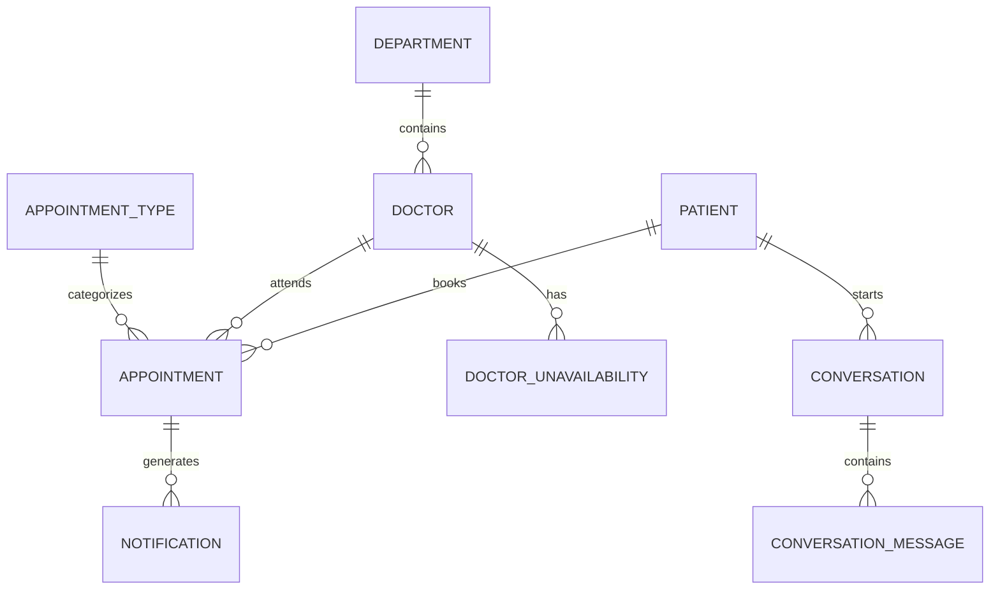

# iClinic AI Front Desk Assistant - Database Design

## Overview

The iClinic system supports:

* AI Chat Assistant
* AI Voice Assistant (Twilio)
* Receptionist Dashboard
* Appointment Scheduling
* Doctor Availability Management
* Conversation History
* Notifications
* Audit Tracking

The design avoids storing individual appointment slots and instead calculates availability dynamically.

---

# Scheduling Architecture

## Doctor Availability Model

Each doctor has standard working hours.

Example:

```text
Dr. John

09:00 AM - 05:00 PM
```

Instead of storing:

```text
09:00
09:15
09:30
09:45
...
```

the system stores:

* Doctor working hours
* Doctor unavailability periods
* Existing appointments

Availability is calculated dynamically.

---

## Availability Formula

```text
Doctor Working Hours
-
Doctor Unavailability
-
Existing Appointments
=
Available Times
```

Example:

```text
Working Hours:
09:00 - 17:00

Unavailability:
12:00 - 13:00 (Lunch)

Appointments:
09:15 - 09:30
10:00 - 10:30
```

Result:

```text
09:00 - 09:15 Available
09:15 - 09:30 Booked
09:30 - 10:00 Available
10:00 - 10:30 Booked
10:30 - 12:00 Available
12:00 - 13:00 Unavailable
13:00 - 17:00 Available
```

---

# AI Booking Workflow

## Step 1

Patient requests:

```text
I need a cardiologist tomorrow morning.
```

AI extracts:

```json
{
  "speciality": "Cardiology",
  "date": "Tomorrow",
  "preference": "Morning"
}
```

## Step 2

Backend Availability Service:

* Finds eligible doctors
* Reads appointments
* Reads unavailability periods
* Determines appointment duration
* Computes available slots

Example response:

```json
[
  {
    "doctor": "Dr. John",
    "start": "09:30"
  },
  {
    "doctor": "Dr. Sarah",
    "start": "10:00"
  }
]
```

## Step 3

AI recommends a valid slot.

Example:

```text
Dr. John is available tomorrow at 09:30 AM.

Would you like me to book that appointment?
```

The AI never performs schedule calculations.

The backend is the source of truth.

---

# Receptionist Dashboard

The receptionist dashboard uses a Gantt-style timeline.

## Color Legend

```text
Green  = Available

Blue   = Booked

Red    = Unavailable
```

## Appointment Width

Appointment width depends on appointment duration.

Examples:

```text
General Consultation
15 minutes

Follow Up
10 minutes

Specialist Consultation
30 minutes

New Patient
45 minutes
```

The draggable appointment block automatically expands based on the selected appointment type.

---

# Database Tables

## DEPARTMENT

Stores medical departments.

### Fields

```text
department_id
name
description
created_at
```

### Examples

```text
Cardiology
Neurology
Orthopedics
Dermatology
```

---

## STAFF

Stores reception and administrative users.

### Fields

```text
staff_id
auth_user_id
full_name
email
phone
active
created_at
```

---

## DOCTOR

Stores doctor information.

### Fields

```text
doctor_id
department_id

auth_user_id

full_name
specialization

email
phone

working_start_time
working_end_time

active

created_at
```

### Example

```text
09:00 AM
05:00 PM
```

---

## PATIENT

Stores patient information.

### Fields

```text
patient_id

first_name
last_name

phone
email

dob
gender

created_at
```

---

## APPOINTMENT_TYPE

Defines consultation categories.

### Fields

```text
appointment_type_id

name

default_duration_minutes

is_emergency

active

created_at
```

### Examples

```text
General Consultation
15 mins

Follow Up
10 mins

Specialist Consultation
30 mins

New Patient
45 mins

Emergency
Variable
```

---

## DOCTOR_UNAVAILABILITY

Stores exceptions to normal doctor availability.

### Fields

```text
unavailability_id

doctor_id

start_datetime
end_datetime

reason

created_at
```

### Examples

```text
Lunch Break

Vacation

Conference

Personal Leave
```

---

## APPOINTMENT

Stores all booked appointments.

### Fields

```text
appointment_id

patient_id
doctor_id
appointment_type_id

start_datetime
end_datetime

status

booking_source

created_by_actor_type
created_by_actor_id

created_at
```

### Status Values

```text
BOOKED
COMPLETED
CANCELLED
NO_SHOW
```

### Booking Sources

```text
AI_CHAT
AI_CALL
FRONT_DESK
```

---

## NOTIFICATION

Stores appointment reminders and notifications.

### Fields

```text
notification_id

appointment_id

notification_type

status

sent_at

created_at
```

### Types

```text
SMS
EMAIL
WHATSAPP
```

---

## CONVERSATION

Represents an entire chat or voice session.

### Fields

```text
conversation_id

patient_id

channel

status

started_at
ended_at

created_at
```

### Channels

```text
CHAT
VOICE
```

---

## CONVERSATION_MESSAGE

Stores every message exchanged during a conversation.

### Fields

```text
message_id

conversation_id

sender_type
sender_id

message_type

content

created_at
```

### Sender Types

```text
PATIENT
AI
STAFF
SYSTEM
```

### Examples

```text
Patient Message

AI Response

Receptionist Message

System Event
```

---

## AUDIT_LOG

Tracks important changes in the system.

### Fields

```text
audit_id

entity_type
entity_id

action

actor_type
actor_id

old_value
new_value

created_at
```

### Examples

```text
Appointment Created

Appointment Cancelled

Doctor Updated

Patient Updated
```

---

# Entity Relationships



---

# Final Table List

```text
DEPARTMENT

STAFF

DOCTOR

PATIENT

APPOINTMENT_TYPE

DOCTOR_UNAVAILABILITY

APPOINTMENT

NOTIFICATION

CONVERSATION

CONVERSATION_MESSAGE

AUDIT_LOG
```

Total Tables:

```text
11
```

---

# Architecture Summary

The system is built around:

```text
Doctor Working Hours
+
Doctor Unavailability
+
Appointments
=
Availability Engine
```

This availability engine is shared by:

* Receptionist Dashboard
* AI Chat Assistant
* AI Voice Assistant
* Future Mobile Applications

This keeps scheduling logic centralized, deterministic, and scalable.
